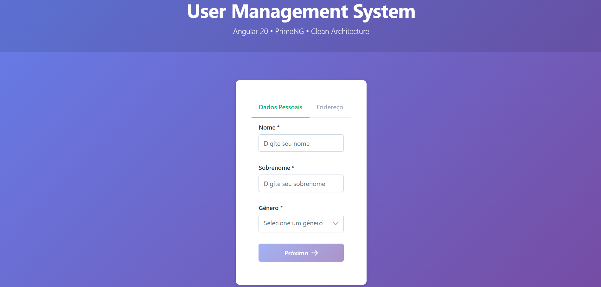

# User Management System — Angular 20 + PrimeNG

Sistema de gerenciamento de usuários desenvolvido com foco em arquitetura organizada, integração externa robusta e boas práticas modernas de frontend.

> Desenvolvido como parte de um desafio técnico.

---

## Tecnologias

- **Angular 20** - Framework frontend
- **PrimeNG 20** - Biblioteca de componentes UI
- **TypeScript 5.6** - Linguagem
- **RxJS 7** - Programação reativa
- **Jasmine/Karma** - Testes unitários

## Funcionalidades

- ✅ **CRUD Completo** - Criar, listar, editar e excluir usuários
- ✅ **Integração ViaCEP** - Busca automática de endereço por CEP
- ✅ **Validações** - Formulários reativos com validações customizadas
- ✅ **Persistência** - LocalStorage para armazenamento de dados
- ✅ **Responsivo** - Layout adaptável para mobile, tablet e desktop
- ✅ **Testes** - Testes unitários para serviços e validadores

## Arquitetura

```
src/app/
├── components/          # Componentes standalone
│   ├── user-form/      # Formulário de cadastro/edição
│   └── user-list/      # Listagem de usuários
├── services/           # Serviços de negócio
│   ├── user.service.ts
│   ├── viacep.service.ts
│   └── storage.service.ts
├── models/             # Interfaces e tipos
├── validators/         # Validadores customizados
├── constants/          # Constantes da aplicação
└── interceptors/       # Interceptadores HTTP
```
A estrutura foi organizada visando separação de responsabilidades, testabilidade e escalabilidade.

## Padrões Aplicados

- **SOLID** - Princípios de design orientado a objetos
- **Reactive Forms** - Formulários reativos do Angular
- **Lazy Loading** - Carregamento sob demanda de componentes
- **Dependency Injection** - Injeção de dependências
- **Observable Pattern** - Programação reativa com RxJS

## Instalação e Execução

### Pré-requisitos
- Node.js 18+
- npm 9+

### Instalação

```bash
npm install
```

### Desenvolvimento

```bash
npm start
```

Acesse: http://localhost:4200

### Build de Produção

```bash
npm run build
```

### Testes

```bash
npm test
```

## Rotas

- `/lista` - Listagem de usuários (página inicial)
- `/cadastro` - Formulário de cadastro/edição

## Componentes PrimeNG Utilizados

- **Table** - Tabela de dados com ações
- **Tabs** - Navegação entre abas do formulário
- **Dialog** - Modal de confirmação
- **Toast** - Notificações
- **ConfirmDialog** - Diálogo de confirmação
- **InputMask** - Máscara para CEP
- **Select** - Dropdown de seleção
- **Button** - Botões de ação

## Validações Implementadas

- Nome/Sobrenome: mínimo 2 caracteres
- Gênero: obrigatório
- CEP: formato 00000-000
- Número: apenas dígitos
- Integração com ViaCEP para validação de CEP

## Tratamento de Erros

- Validações reativas com feedback inline
- Diferenciação entre erro de validação e erro de integração
- HTTP Interceptor para centralização de erros
- retry() para falhas temporárias de rede
- timeout(10000) para evitar requisições pendentes

## Estrutura de Dados

Dados persistidos no LocalStorage com a chave `users`.

## Contexto

O projeto foi desenvolvido com foco em organização arquitetural, integração robusta com APIs externas e aplicação de boas práticas modernas utilizando Angular 20.

## Preview
